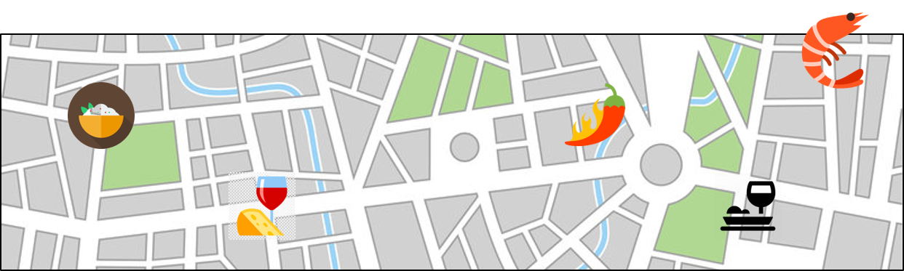
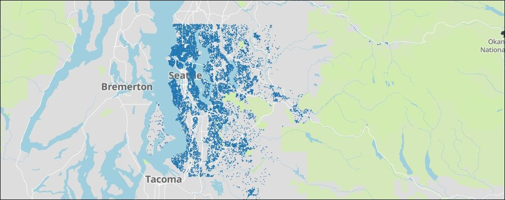
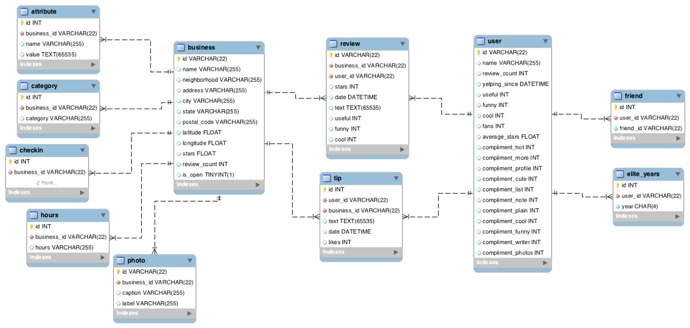

___Note___: _An extended version of this work will be my MSc thesis at Georgia Tech._

### Motivation

- __Have you__ ever thought about funding a business in the  __food and drink__ industry? Have you ever wanted to have your own business but you did not know what and where? 
- __You__ did not know to what capacity you should invest. You did not know what kind, i.e., restaurant, coffee shop, pub, pizza place or stake house. You did not know in downtown, near your apartment, north of town, in an expensive area, etc. You did not know what menu you should offer. You did not know about your business model. And of course tens of other key questions.
- __You__ wanted to talk to a financial advisor, a business consultant, a talented chef, your mom, your friend who likes sushi, ... You were thinking of having a conversation with someone on Wall Street ... And, many other approaches.  
- __Is__ there any one-fit-all solution? I think there is. Data can help us out. It is no longer in hands of some genius people who can predict the future. This is a multi-dimensional problem and we have data in many of those dimensions. 
- __This__ is a multi-tier problem solving project in business analytics. The idea is very simple. Through data, we know how often people go to what restaurant and roughly how much they spend. We know economics of different areas in a city, we know how hard/easy it is for people to move around to reach a popular place, we can estimate traffic, we know parking capacity, we know weather challenges, we know ... and there are huge amount of data that is available to support us. It is the matter of how efficient we can link them.
- __Result__ of this project is a map. A map that can help (current and future) businesses think about their next move. If you already have a business, you want to know what near future might look like in your specialty. If you want to open a new business, what cuisine you should think of and where.

### Experiment Unit
I live and eat in __Seattle__. No need to explain why I would want to run this project in my city. To start, I would consider  restaurants only. There are some early hypothesis testing and proxy modeling that are needed to be made before I can confidently scale it up and include more dimensions. Seattle is the proof of concept.

### Impacting Factors
This problem is multi-dimensional with probably a very long list of factors. Affordability (financial), location (vibe, adjacent businesses), accessibility (traffic, parking, etc.), service quality (cuisine type, food quality, etc.), population density, and customer satisfaction are among many others. However, for the sake of this short project, I limit myself to two:

- Affordability (financial)
- Trends (and forecasts) of highs/lows of demand in segments of the industry. Segments related to:
    - Location
    - Service characteristics

These two factors, can help generating a map that characterizes food business values in Seattle.

### Step One: Area-Based Affordability Metric (60% of the overall project)

In the first step, I needed a proxy to be able to learn financial capacity of different areas in Seattle. There is data from decennial census that can be used. However, it does not provide granularity at the level required for this project. More over, it is a bit more fun to explore other sources. For this reason, I built up my proxy from the attractive housing market in Seattle. The proxy predicts property price per square footage as a function of location (X, Y). This work was a separate project I did on Seattle's housing market. The data is limited to 2014-2015 and extension of the work to today's [crazy] market is not practical. Data exploration and ML modeling is captured in multiple `Jupyter` Notebooks in [this repository](https://github.com/a-azad/Seattle.housing.market). The map below, show the density of housing data in the dataset. The data is a [Kaggle dataset](https://www.kaggle.com/harlfoxem/housesalesprediction).

In short, housing market analysis provides two major outputs:
* An affordability metric which is a normalized $/sqf function per location.
    - The metric is normalized based on property characteristics and population. Population data was read from [Statistical Atlas Website](https://statisticalatlas.com/place/Washington/Seattle/Household-Income).
* A proxy that can estimate the value of _access to local business_ per location. This is really cool! It basically shows how different neighborhoods may react to new businesses.

The problem is initially a regression modeling exercise. Simple linear model to tree-based algorithms were used. Although Random Forest (like always) offered a significant improvement to the model, for the purpose of statistical inference, improved (Ridge) linear model was chosen. Figure below, show the locations where home price can be estimated. 

### Step Two: Business Segmentation (25% of the overall project)
The interesting and a bit challenging part of this project is to learn trends of the market from the attractive [Yelp Open Dataset](https://www.yelp.com/dataset). In this project, __YELP__ dataset is explored to show the advantage of using a large dataset.  
  
__YELP Data Preparation__  
The popular Yelp dataset is repeatedly referenced in ML/NLP projects. In _Step Two_ I use it to segment and collect information about food businesses in Seattle. The data is provided in `JSON` and `SQL` format via [Yelp Open Dataset](https://www.yelp.com/dataset). It is also available via[Kaggle's page](https://www.kaggle.com/yelp-dataset/yelp-dataset) or [Kaggle's API](https://github.com/Kaggle/kaggle-api). Just for fun and to explore multiple options, I followed these steps:

- Imported JSON-converted CSV's via Kaggle's API
- Built a local SQL database from scratch
- Accessed to the database via a localhost

Again, this is not necessarily an optimum approach but it gave me an opportunity to learn. The SQL database was built in `PostgreSQL`. Codes related the data handling process as explained above are stored in [this folder](https://github.com/a-azad/Food.Drink.Business.Value.Mapping/tree/master/data_handeling) --data is not loaded on Github for the size of files, >7GB). The figure below is the structure of the SQL database schema (from Yelp's website).

### Step Three: Application Development | Visualization (15% of the overall project)
The result of this project will be customizable map. A user should expect to:

1- Provide values for map discretization. Seattle map is discretized into blocks.
2- Select business(es) of interest from a list.
3- Read some statistics of each discrete block by hovering over Seattle's map. Basic statistics such as:
    - Number of total businesses
    - % of select businesses per block
    - Population
    - Financial metric ($/sqf)
    - Neighborhood local business metric
    - Business performance (service performance?) rate compared
4- 